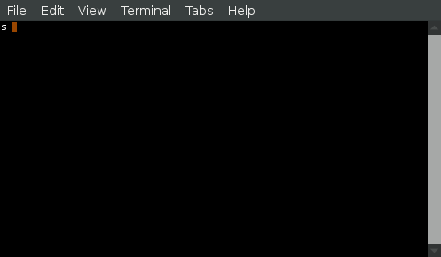

# `gosleep`

`sleep(1)`, but with Go duration parsing (`1m`, `2h3m2s`) OR explicit time to sleep until (`13:04`, `2016-11-18 00:00:00`) and a progress bar.

[](https://travis-ci.org/tianon/gosleep)

# Example



```console
$ gosleep --help
Usage:
  gosleep --for <duration> OR --until <time>

Application Options:
      --for
      --until

Help Options:
  -h, --help   Show this help message

$ gosleep --for 10s
 10s / 10s [███████████████████████████████████████████████████████████] 100.0% 
$ date
Tue Dec 13 14:38:20 PST 2016
$ gosleep --until 14:38:20
error: requested sleep time in the past: -8.415878269s
$ gosleep --until 14:39
 19s / 19s [███████████████████████████████████████████████████████████] 100.0% 
$ gosleep --until '2016-11-17 00:00:00'
error: requested sleep time in the past: -638h39m3.910603384s
$ gosleep --until '2017-01-01 00:00:00'
^C8s / 441h20m45s [                                                    ]   0.0% 
$ gosleep --until '2016-12-13 17:00'
 22s / 2h19m6s [▏                                                      ]   0.3% 
```
